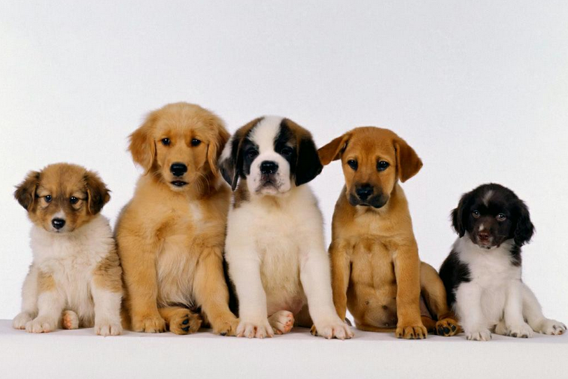
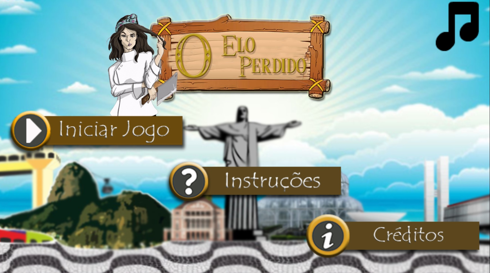

    
_Criando minha página inicial._

# *Quem sou eu*

Alexsandro Alves, Discente do curso de Programação de Jogos Digitais <3

# *Portfólio*

## *Games*

.

[Quiz de Memes](https://alex-alves.github.io/AOD/).

[Protecting my Mouth](https://alex-alves.github.io/TD/).

## *Artes*

  
  
 
## *Apresentações*

* Aula de Musica   
* Aula de Artes   
* Aula de Jogos   
1. Marcelo   
2. Durval    
3. Tiago   

* * * 

** NEGRITO  
~~ riscado  
_ ITALICO

DOIS ESPAÇOS PARA PULAR LINHA  
TRÊS asterico* ADICIONA UMA LINHA HORIZONTAL      
Hashtags# uma ou mais criam capítulos ou sub-capítulos      
asterico* adiciona uma lista não numerada.     
numeros1 adiciona uma lista numerada.       

* * * 
